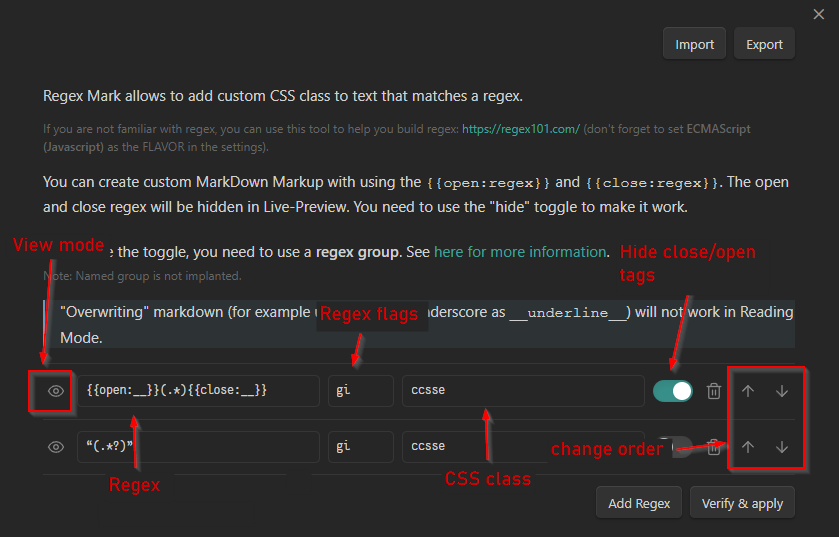
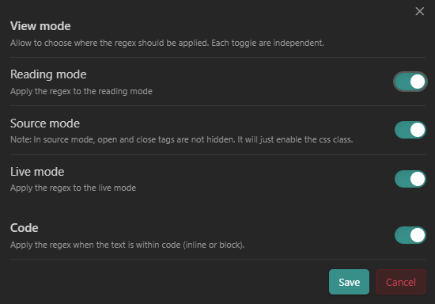

Obsidian Regex Mark is a plugin for [Obsidian](https://obsidian.md/) that allows to add custom CSS classes to text based on regular expressions.

# Usage

Add a regular expression and a CSS class to the plugin settings. The plugin will then add the CSS class to any text that matches the regular expression.

The contents of the regex will be added to the span tag with the `data-content` attributes for a more granular styling.

# How it works

The following regular expression will add the CSS class `comment` to any text that matches the regular expression.

```
regex: //.*$
class: comment
```

And the following text:

```markdown
This is a normal line of text. //This is a comment.
```

will be converted to:

```html
<p>This is a normal line of text. <span data-contents="//This is a comment." class="comment">//This is a comment.</span></p>
```

It is also possible to create "custom" Markdown tags using the `{{open:regex}}` and `{{close:regex}}` syntax. You need to toggle the option `hide` to enable it.

> [!NOTE]
> The usage of `__` for underline (ie `__text__`) is not supported in reading
> mode, but works well in Live Preview!

The plugin will mimic the behavior of Obsidian with transforming:

```markdown
__text__
```

to:

```html
<span class="underline" contenteditable="false">
  <span>
    <span class="cm-hide">__</span>
    <span class="underline">this is a normal text with underline (in LP)</span>
    <span class="cm-hide">__</span>
  </span>
</span>
```

The css will after hide the `.cm-hide` class, unless you select it (only in livePreview for the selection).

Selecting the text will show everything, like with other markup.

# Settings



## View mode


You can disable "per view" the regex, aka, disabling for:

- Reading mode
- Live Preview mode
- Source mode

Each toggle are independent, so you can disable for reading mode, but enable for live preview mode.

You can also disable/enable a snippet within code (code-block or inline, between backticks), with toggle "Code".

# Next steps

You can then use the CSS class to style the text in your CSS snippet or any other usages. You can even import or export settings from others!

## Examples

- Underline : `{{open:__}}(.*){{close:__}}`
- SuperScript : `{{open:\^}}(.)` (Note: It works for "one" character only here, but you can use
  `^x^` syntax if you want to use for more text:
  `{{open:\^}}(.*){{close:\^}}`)
- SubScript : `{{open:_}}([a-zA-Z\d]\b))` (As before, it works for only one element)

The css for the above example is:

```css
.superscript {
    vertical-align: super;
    font-size: 90%;
}

.subscript {
    vertical-align: sub;
    font-size: 90%;
}
```

---
> [!WARNING]
> If your Obsidian refuse to open a file, and you get this error in the console:
>
> ```shell
> RangeError: Decorations that replace line breaks may not be specified via plugins
> ```
> That's mean that one of your regex doesn't work inside Obsidian. You need to check every regex you have added to find the one that cause the issue and delete it, and reload Obsidian to make it work again.
> I tried to find a way to catch the error and display it in the console, but I didn't find a way to do it... So, if you have any idea, I'm open to suggestions!

---

# Credits

- [rien7](https://github.com/rien7/obsidian-regex-mark): Original work
